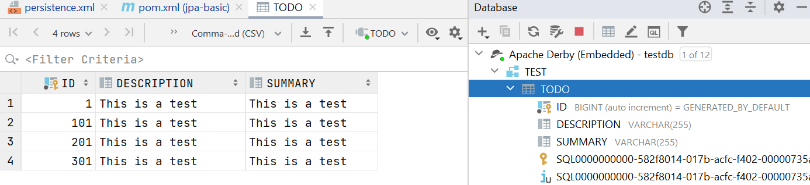

# Experiment 1
## Technical Problems
I cloned the project as decribed and ran main to test my installation and got this error message:

`The java.lang.Object class was compiled with an unsupported JDK. Report this error to the EclipseLink open source project.`

I changed the path of the "javax.persistence.jdbc.url" to match my directories. I also tried to change the  maven dependency version of eclipselink to the latest one but now it didn’t recognize javax.persistence annotations so I had to add the jar libraries to the lib folder. I run it again but now it gives me this error:

`Exception in thread "main" javax.persistence.PersistenceException: No Persistence provider for EntityManager named todos`

Okay now im getting annoyed, I remove everything in the lib folder, revert every change I made in the persistence.xml file (except the file path change) and go read the tutorial again. The exercise says to skip step 3, but step 4 starts by saying we should add the derby.jar and eclipselink.jar in the lib folder which we would have downloaded in step 3. I ignored this the first time since I thought we were told to skip this (this part was a little confusing for me), but then I downloaded the jars and added them to the lib folder. I run the program and get a new error message (forgot to save it), but things looked promising and i knew almost certainly what the problem was. I forgot to uncomment this line:

`<!--<property name="eclipselink.ddl-generation" value="create-tables" />-->`

After removing the comment and running it again then everything ran smoothly. Success!

## Inspecting The Database
I used the built-in database tool in IntelliJ to inspect the database. I provided an connection to the Apache Derby database by providing the folder of the database (which is located where i specified in the persistence.xml file), and the username and password (which i also found in the persistence.xml file). You can look through all tables and columns in a database with the database tool (See screenshot below)

