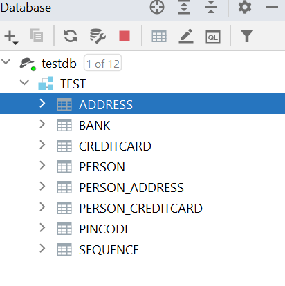
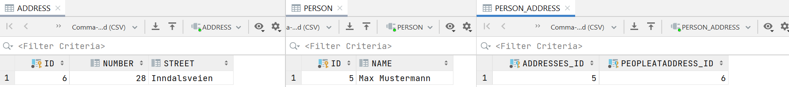
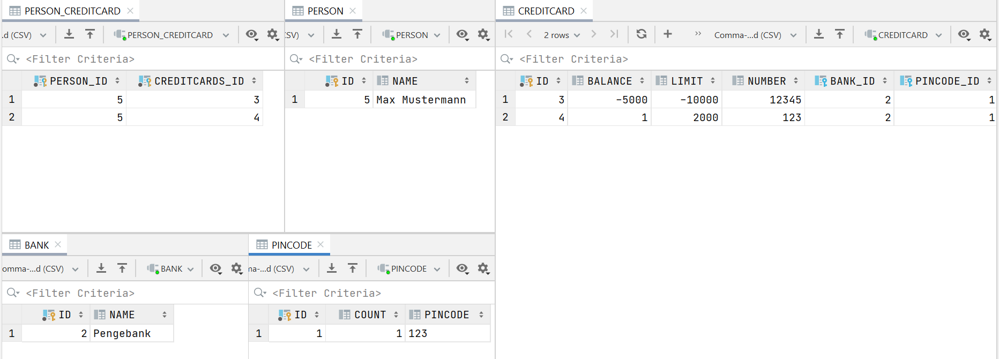

# Experiment 1

[Link to code](eclipselink/jpa-basic)

## Technical Problems
I cloned the project as decribed and ran main to test my installation and got this error message:

`The java.lang.Object class was compiled with an unsupported JDK. Report this error to the EclipseLink open source project.`

I changed the path of the "javax.persistence.jdbc.url" to match my directories. I also tried to change the  maven dependency version of eclipselink to the latest one but now it didn’t recognize javax.persistence annotations so I had to add the jar libraries to the lib folder. I run it again but now it gives me this error:

`Exception in thread "main" javax.persistence.PersistenceException: No Persistence provider for EntityManager named todos`

Okay now im getting annoyed, I remove everything in the lib folder, revert every change I made in the persistence.xml file (except the file path change) and go read the tutorial again. The exercise says to skip step 3, but step 4 starts by saying we should add the derby.jar and eclipselink.jar in the lib folder which we would have downloaded in step 3. I ignored this the first time since I thought we were told to skip this (this part was a little confusing for me), but then I downloaded the jars and added them to the lib folder. I run the program and get a new error message (forgot to save it), but things looked promising and i knew almost certainly what the problem was. I forgot to uncomment this line:

`<!--<property name="eclipselink.ddl-generation" value="create-tables" />-->`

After removing the comment and running it again then everything ran smoothly. Success!

## Inspecting The Database
I used the built-in database tool in IntelliJ to inspect the database. I provided an connection to the Apache Derby database by providing the folder of the database (which is located where i specified in the persistence.xml file), and the username and password (which i also found in the persistence.xml file). You can look through all tables and columns in a database with the database tool (See screenshot below)

# Experiment 2

## Technical Problems
I cloned the same project again and removed the todos system and replaced it with the bank system. I added one piece at a time starting with the Person object and then Address.
I made the person the owner of the relation by adding the mappedBy tag to the @ManyToMany annotation in the address class. Saving the objects in a jointable worked fine but i had some problems with the java address object not having a list of the persons at that address (even though they are connected in the database). I did some googling and found this nice [article](https://vladmihalcea.com/the-best-way-to-use-the-manytomany-annotation-with-jpa-and-hibernate/) which solved the problem by creating an addAdress method to person class which updates the list of adresses in the person class and then update the list of persons in the address class. However, now i had a stackoverflow problem since the toString method of the person class uses the toString method of the address, which in turn references the toString method of the person class, creating an infinite loop (the same applied to the hashcode function). I fixed this by overriding the methods and made the address toString method not use the toString method of person, but trather a custom toString method of person that does not mention the addresses. Adding the CreditCard and Pincode classes and connecting them to the person class went smoothly, but connecting the creditcard and bank classes was a massive problem. I tried really hard to make the bank the owner of the relation by creating a jointable like this in the creditcard class:

   
    @ManyToOne
    @JoinTable(
            name = "BANK_CREDITCARD",
            joinColumns = @JoinColumn(name = "BANK_ID"),
            inverseJoinColumns = @JoinColumn(name = "CREDITCARDS_ID")
    )
    Bank bank

Creating the jointable worked but persisting bank and creditcard objects was giving me errors about inserting keys into the jointable that already existed. After googling for hours and endless stackoverflow posts i found very few examples of people creating a bi-directional relationship of OneToMany and ManyToOne where the "one" is the owner. In the end i ended up making the creditcard the owner by adding a joincolumn in the creditcard table. This made it much simpler and i could actually run the program.

## Inspecting The Database
I did the same steps as above. If i really wanted to make sure the object links are saved correctly in the database i would've have made several test cases which sent queries to the database retrieving the data and made sure it is stored correctly. However, i don't really have time to do that and after looking at the database im pretty confident the database is set up how i wanted it to be. Screenshots of the database below.
### Database table overview

### Person Address Database Relationship

### Person CreditCard Bank Database Relationship

