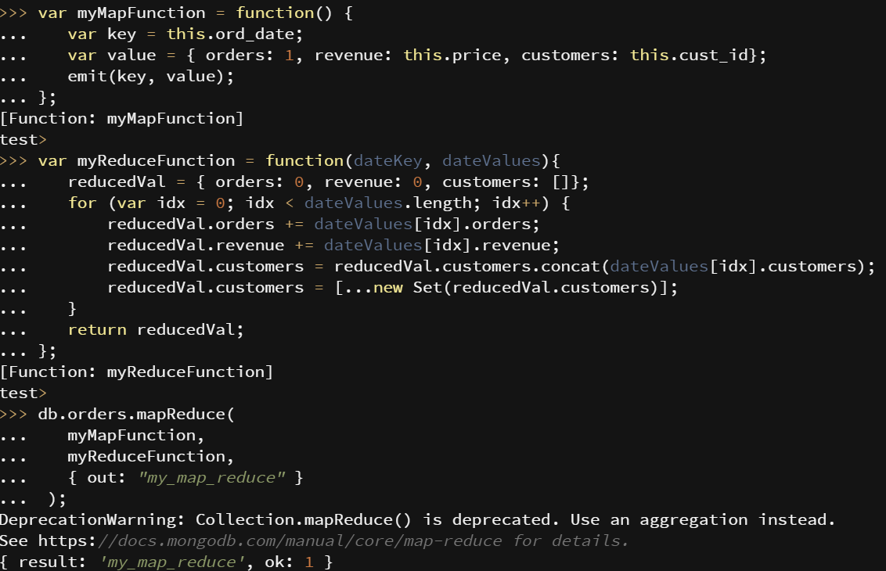
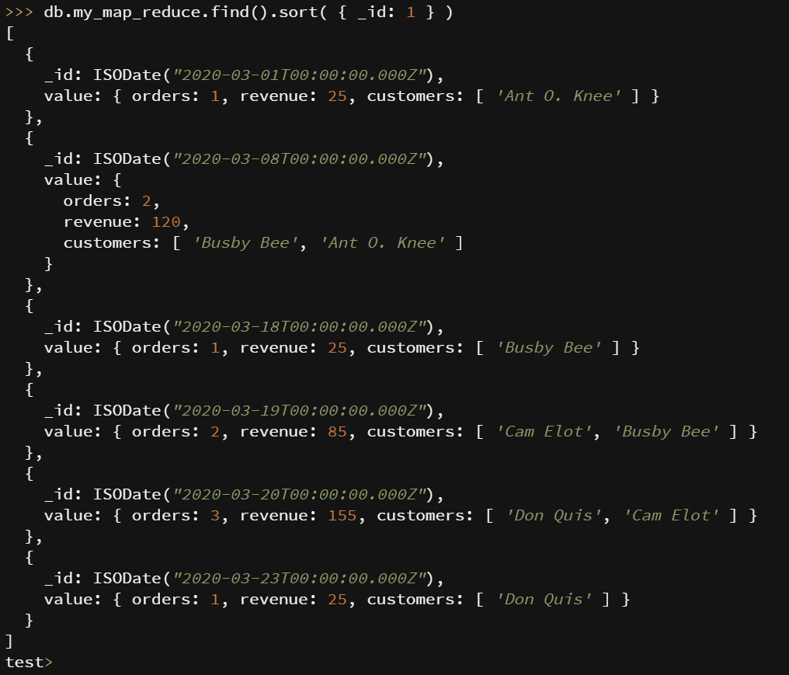

## Technical problems
For once the installiation part went smoothly. The only thing i had some problems with was the query/read part of the tutorial defaulted to the Compass "language". I tried to insert the collection we were given into the database with Compass however that didnt accept the syntax of the collection. They also supported inserting data with a json file, and the collection was almost in json format but did not have quotation marks around the key names. Luckily, i found an online tool that fixed that problem automatically. The queries in Compass worked fine. 

## My map reduce operation

I implemented a map reduce operation that will find information on each date where there was a order. The information contains how many orders there were that day, how much revenue was made, and what customers made an order that day. This is useful operation to get a quick insight into the sales for a business. For example, this information can show if the revenue made is at an upwards trend, downwards trend or if it is steady. The [screenshots](#mro) at the bottom of the file show the operations and the result.

## Screenshots

### Validation

### Insert operation

### Read operation

### Update operation part 1

### Update operation part 2

### Delete operation

### Map reduce example 1

### Map reduce example 2

### My map reduce operation 1

### My map reduce operation 2

